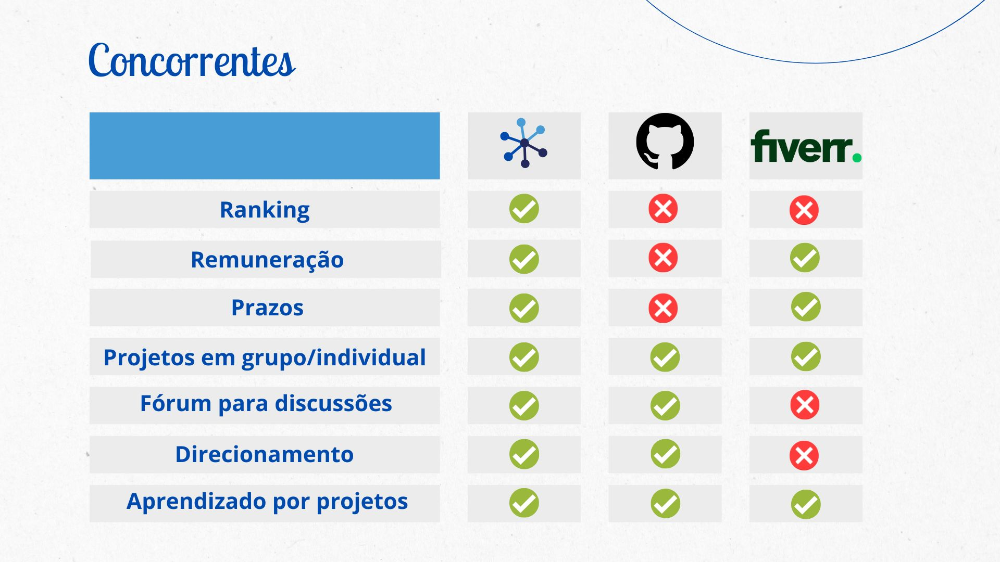

# ConectPlus

A aplicação foi criada como projeto para o disciplina de Residência II pela Universidade Tiradentes.

## Pitch

De acordo com a Associação Brasileira de Empresas de Software, o Brasil apresentou um crescimento de 22,9% na área de TI. Assim, a nossa empresa quer aproveitar a oportunidade deste mercado crescente e com previsão de procura por 420 mil profissionais de TI até 2024, isso, segundo a Brasscom, Associação Brasileira das Empresas de Tecnologia da Informação e Comunicação. Logo, com o aumento da demanda por soluções tecnológicas, justifica-se a necessidade da criação do site Conecta+. O site proporciona uma comunidade autossustentável e resolvedora de problemas nas diversas áreas de TI, por meio da interação entre pessoas físicas e jurídicas por ações individuais ou em parceria. Aqui o cliente aprende com quem resolve os problemas na prática, por isso os profissionais podem ser contactados para ensinar, os quais também aprendem pelos projetos que desenvolvem e são remunerados por meio de cash e também ganham pontuação pela qualidade do seu serviço, além de oferecer um fórum para a Networking. Não estamos voltados apenas para o "trabalho decente", mas também ao aprendizado. Diferentemente da concorrência, na nossa plataforma as soluções são remuneradas, pontuadas e rankeadas. Venha conosco e adapte-se à era digital como Conecta+.

## Definição do Aplicativo
O **Conecta+** é uma plataforma online que conecta empresas e profissionais de TI, programação e áreas correlatas. Dependendo da demanda, também pode incluir especialistas em negócios, oferecendo soluções sob medida para diferentes tipos de problemas. O Conecta+ promove um ecossistema colaborativo que recompensa **competência, reputação e networking**, incentivando tanto o crescimento profissional quanto a geração de oportunidades reais de emprego e empreendedorismo.

## Funcionalidades

- **Ranking de Profissionais**  
  Profissionais são avaliados e pontuados em cada área de atuação, facilitando a escolha por parte de quem contrata.

- **Gestão de Prazos e Pontuação**  
  Cada tarefa possui prazos definidos. O cumprimento ou descumprimento das metas gera ganho ou perda de pontos para os profissionais.

- **Trabalhos Individuais ou em Grupo**  
  Flexibilidade para realização de projetos de forma independente ou colaborativa.

- **Sistema de Remuneração**  
  Problemas são remunerados em dinheiro (*cash*). O Conecta+ retém uma porcentagem do valor, assim como outros aplicativos de referência (ex.: Uber, iFood).  
  Além disso, uma **pontuação adicional** é concedida, proporcional ao valor pago e à complexidade da solução entregue.

- **Fóruns de Networking**  
  Espaço para interação entre profissionais e empresas, incentivando parcerias e estratégias de empreendedorismo.

- **Desbloqueio por Pontuação**  
  Ao atingir determinadas pontuações, o usuário ganha acesso a desafios mais complexos e pode obter **contato direto com empresas**, ampliando as oportunidades de empregabilidade.

- **Soluções Públicas ou Privadas**  
  O contratante decide se o problema será público ou privado.  
  - **Público**: o contratante recebe pontuação de volta se for bem avaliado pelo contratado, fortalecendo sua reputação na plataforma.  
  - **Privado**: restrito apenas às partes envolvidas.

- **Suporte e Dúvidas**  
  Suporte integrado para auxílio durante o processo de solução.

- **Premium**  
  Usuários podem acionar profissionais mais qualificados em caso de dificuldade para cumprir prazos ou solucionar problemas.  
  - O profissional premium pode aceitar ou não o chamado.  
  - Caso aceite, há um prazo para análise.  
  - O suporte é remunerado com uma porcentagem do valor da tarefa original.  
  - A formação de parceria exige aceite de todos os envolvidos.
 
## Concorrentes 


### Fiverr
O **Fiverr** é um mercado online que conecta freelancers a clientes em diversas áreas, como:
- redação,
- design gráfico,
- programação,
- tradução,
- marketing digital, entre outras.  

No Fiverr, os freelancers criam perfis, listam seus serviços e definem preços. Já os clientes podem navegar entre as opções, comparar profissionais e contratar quem melhor atende às suas necessidades.  
A plataforma oferece **segurança e transparência** no processo de contratação e pagamento, além de ser global, permitindo que pessoas talentosas ofereçam seus serviços de forma independente.  

**Contraproposta – Conecta+**  
Diferente do Fiverr, que parte da **oferta de serviços** do freelancer, o Conecta+ parte da **demanda do contratante**.  
- No Fiverr: o contratado exibe suas habilidades e espera ser acionado.  
- No Conecta+: o contratante disponibiliza seu problema e busca soluções sob medida.  

---

### GitHub
O **GitHub** é uma plataforma de hospedagem de código-fonte e colaboração para desenvolvedores.  
Seus principais recursos incluem:  
- criação e gerenciamento de repositórios,  
- versionamento de código,  
- controle de alterações,  
- gerenciamento de issues,  
- colaboração via *pull requests* e revisões de código.  

Além disso, o GitHub também oferece ferramentas para documentação, organização de projetos e é referência mundial no desenvolvimento de **software de código aberto**.  

**Contraproposta – Conecta+**  
O diferencial do Conecta+ está no foco em **remuneração direta** e na **resolução de problemas reais**, com um sistema de ranking que classifica os profissionais por desempenho em cada área.  
Enquanto o GitHub foca na **colaboração de código e projetos open source**, o Conecta+ foca em **desafios práticos** e **mercado de trabalho remunerado**.


## MVP do Sistema

A aplicação apresenta um fluxo de telas que abrange as seguintes páginas: inicial, login, cadastro e perfil do usuário. A página inicial oferece links para as abas: "Home", "Ranking", "Perfis", "Projetos Disponíveis" e "Fórum". Ao acessar o site, o usuário pode clicar no botão "Login/Cadastro", permitindo realizar o cadastro e, em seguida, efetuar o login. Após o login, o usuário é redirecionado para a página de perfil, que inclui um botão "Sair". Esse botão possibilita o retorno à página inicial, permitindo repetir o ciclo de navegação conforme necessário.

## Tutorial para inicializar o sistema

Para começar, siga estes passos:

1. Abra as pastas do front-end e back-end em diferentes janelas do VS Code (a IDE utilizada).

2. Na pasta do back-end, substitua os campos no arquivo `index.js` com suas credenciais:

```javascript
const secret = "mysql"; //JWT

const sequelize = new Sequelize('nome do schema no BD', 'usuario', 'senha do BD', {
  host: 'localhost',
  port: 3306,
  dialect: 'mysql',
  define: {
    freezeTableName: true
  }
});
```
3. Após configurar as credenciais, ainda no diretório do back-end, execute os seguintes comandos no terminal:

Este comando instalará todas as dependências necessárias: 
```
npm i
```

Este comando iniciará o servidor back-end:
```
npm start
```

4. Agora, você pode abrir o arquivo index.html do front-end no servidor. No caso, pode usar o Live Server.

Obs.: Em caso de erro após o primeiro ciclo de welcome -> cadastro -> login -> perfil, verifique se o servidor Node.js ainda está em execução no banco de dados. Se não estiver, pressione "ctrl c" para limpar o terminal e execute npm start novamente para restaurar as funcionalidades da aplicação.

## Stack de desenvolvimento front-end
HTML, CSS, JS.

## Stack de desenvolvimento back-end
Foram itilizados JavaScript, Node.js, Express.js para criar APIs, Sequelize como ORM para interagir com um banco de dados MySQL, e JWT para autenticação

De forma detalhada:

1. **Node.js**: Ambiente de tempo de execução para JavaScript.
2. **Express.js**: Framework web para Node.js, utilizado para criar APIs RESTful.
3. **Sequelize**: ORM (Object-Relational Mapping) para Node.js, usado para interagir com o banco de dados MySQL.
4. **bcryptjs**: Biblioteca para criptografar senhas.
5. **jsonwebtoken**: Para geração e verificação de tokens JWT para autenticação.
6. **cors**: Middleware do Express para habilitar o CORS (Cross-Origin Resource Sharing).
7. **MySQL**: Banco de dados relacional utilizado para armazenar os dados da aplicação.
8. **package-lock.json**: Arquivo que garante a consistência das versões das dependências instaladas em um projeto Node.js, assegurando reprodutibilidade e segurança nas instalações.
9. **package.json**: Arquivo para gerenciar as dependências do projeto e scripts de inicialização.
10. **.gitignore**: arquivo contendo o `node_modules`.

#Fgma
Figma: https://www.figma.com/design/5ayBn5KzvjctjQ0bM3u7mR/Conecta--?node-id=0-1&p=f&t=APF5phOQaUVzIkW7-0
